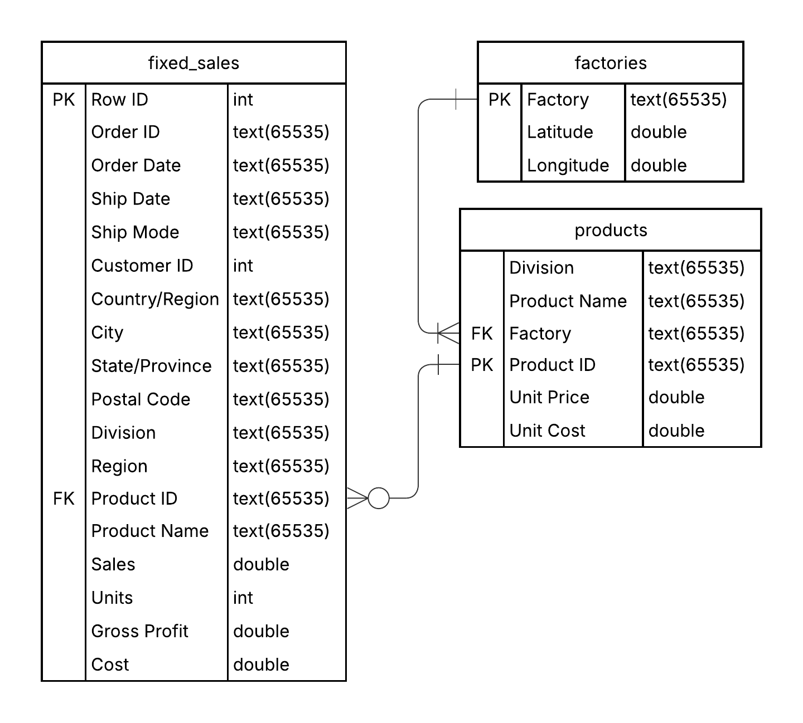
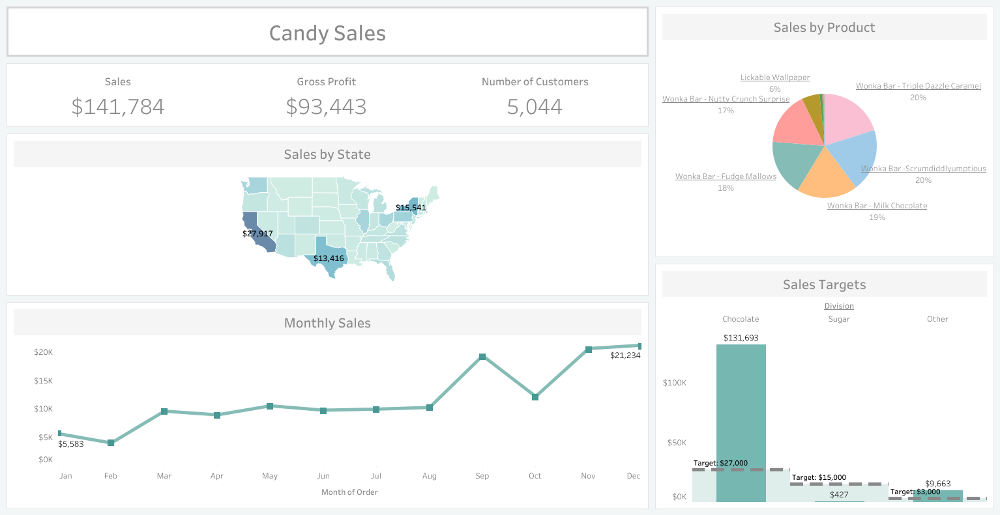
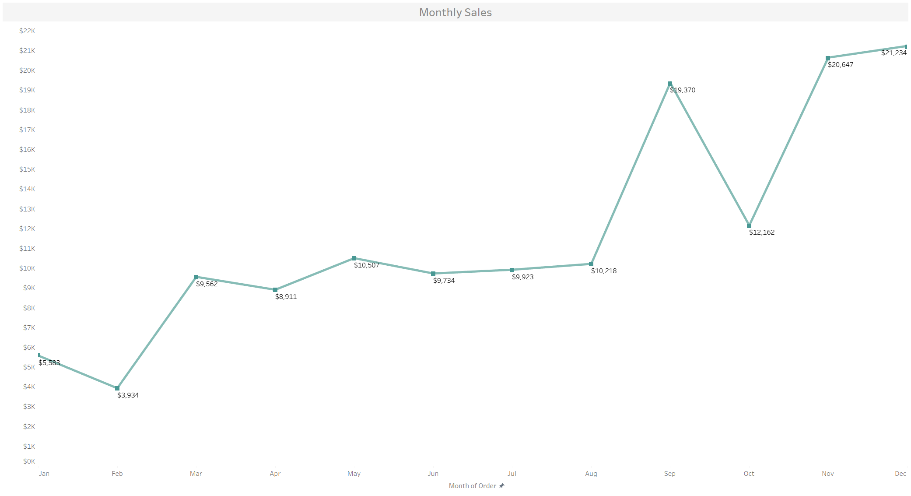
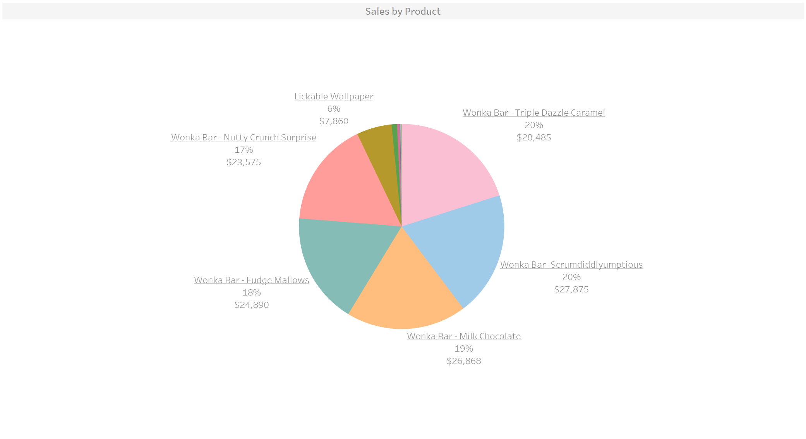
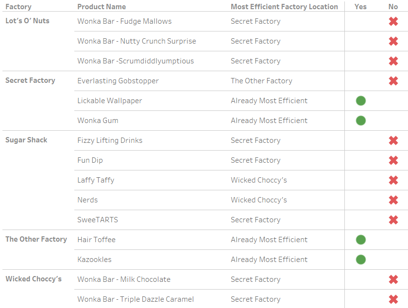

# Project Background
This project is based on a data set provided by Maven Analytics and features a presumably fictitious candy company. This company has 5 factories that each specialize in producing various product types and also seems to sell and distribute its candy products directly to customers, most of whom reside in the U.S. 

The company recorded and stored its sales data from 2021 to 2024, including customer location and order volume. Insights and recommendations are provided on the following key areas:

- **Sales Targets:** Goals were established for sales of each candy division; we evaluate whether these targets were met and where expectations should be adjusted. 
- **Sales Trends:** Viewed sales through different time periods, aiming to uncover any trends in customer activity based on seasonality.
- **Product Performance:** Assessed which candy products bring in the most revenue and profit, giving more insight on which to focus on.
- **Shipping Distance Optimization:** Analyzed average shipping distance for each product with the goal of finding optimal factory production setups.

SQL queries addressing business questions can be found [here](Documents/CandySalesAnalysis.sql).

An interactive Tableau dashboard condensing insights can be found [here](https://public.tableau.com/views/CandySales_17382172603680/Sales?:language=en-US&:sid=&:redirect=auth&:display_count=n&:origin=viz_share_link).

# Data Structure

The dataset has 3 main tables. A description of each table is as follows:
- **Sales:** Each row represents a product bought in an order, with multiple rows being used for a single order if the customer bought multiple products. Contains additional information on order and shipping dates, customer location, and sales revenue.
- **Factories:** A small table of the 5 different factories and their locations in latitude and longitude.
- **Products:** Lists all the products sold by the company, along with which factory each one is made in, what division the product belongs to, and each candy's price and cost.

# Executive Summary

### Overview of Findings

Chocolate products performed very well relative to expectations and were also the best-selling type of product by far, while sugar products overwhelmingly underperformed. Analysis of revenue over each yearly period revealed that the most successful months were September, November, and December, each of which saw around 2 times as much revenue as other months. On the shipping distance optimization side, it was found that only 4 products were already produced in their optimal factory, leaving 11 products with room for improvement.

# Insights Deep Dive
### Sales Targets:

* Chocolate product sales exceedingly overperformed relative to the initial goal, bringing in **$131,693 of revenue during the 4-year time period**. This represents **488% of the $27,000 sales target for chocolate**, indicating their popularity amongst the customer base.
  
* The worst performing product type by far was sugar, which only managed to bring in **$427 in sales**, completely missing the initial target of $15,000.
  
* Candy products that were classified as other than chocolate and sugar were very successful relative to its set goal of $3,000. These products generated **$9,663 in revenue, which is 322% of the target**.

### Sales Trends:

* **Sales were highest in December and November,** with both months seeing about **$21,000 of revenue** each from 2021 to 2024. This is likely a result of customers purchasing more candy for the holiday season and festivities.
  
* **September followed closely behind with $19,370 of total revenue**. Possible contributing factors to the relatively high revenue of the September months are the incoming new school season and customers stocking up on candy early for Halloween the next month. 
  
* Surprisingly though, the **total revenue for the October months is only $12,162**, which is only slightly higher than the average total month's revenue of $11,815. October should usually see a high amount of candy purchases as a result of Halloween, yet it seems to be underperforming relative to these expectations.
  
* In the 4 year timeframe, **the company's yearly revenue increased by 162%, from $28,954 in 2021 to $46,968 in 2024**. Consistent growth is shown from 2022 to 2024, with the most noticeable yearly increase of $10,109 occurring last year.

### Product Performance:

* Wonka Bar products are the overwhelming bulk of the company's sales, bringing in a whopping **$131,693 of revenue**, making up **92.88% of the company's total revenue**. In terms of units sold, Wonka Bar products also dominate sales, making up **96.43% of all candy products sold**.
  
* The different types of Wonka Bars are fairly even in terms of sales, with each of the 5 products generating around **17% to 20% of total revenue**. The Wonka Bar - Milk Chocolate leads in terms of units sold, while the Wonka Bar - Triple Dazzle Caramel and Wonka Bar - Scrumdiddlyumptious both seem to be most successful in terms of revenue.
  
* As for other, non-Wonka Bar candies, the only two notably worthwhile products are Lickable Wallpaper and Kazookies. Lickable Wallpaper makes up **5.54% of the company's total revenue** for the 4-year period, yielding **$7,860 in sales**, and Kazookies makes up **0.85%, generating $1,206**.

### Shipping Distance Optimization:

The goal of this analysis is minimizing shipping costs by reducing the average distance each product needs to travel to reach its customers. We accomplished this by calculating the factory-to-customer shipping distance of each order and finding averages of these distances for each product. In a similar fashion, we calculated the average theoretical distance each product would have taken to reach customers if the product were produced in all of the other factories. Having all of these values, we surfaced insights regarding the shipping efficiency each product currently has and any possible improvements. 

* Only **4 of the 15 products** are already produced in their most efficient factory, with "most efficient" in this context meaning the factory that would allow for the lowest average shipping distance for each product.
  
* The other 11 products all have factories other than their current one that would allow for shorter shipping distances on average. The differences in average shipping distance between their actual factory and their theoretical most efficient factory range from **326 km to 800 km**.
  
* **Nerds is the least efficient product in the sense of shipping distances**, with there being an 800 km difference in shipping routes between its current factory Sugar Shack and its optimal factory Wicked Choccy's. **Fun Dip, Wonka Bar - Fudge Mallows, and Wonka Bar - Nutty Crunch Surprise follow**, with differences of 710 km, 634 km, and 613 km, respectively.
  
* The following chart showcases all the products and whether or not each is already produced in the factory that minimizes shipping distance. **Lickable Wallpaper, Wonka Gum, Hair Toffee, and Kazookies are already produced in their most efficient options**; the others have their optimal factory listed below.

# Recommendations:

Based on the insights and findings above, we would recommend considering the following:

* Sales for each product division were profoundly different from their initially set goals, with chocolate and other candy products vastly overperforming and sugar candy products completely failing to live up to expectations. **It is likely best to shift focus away from producing and distributing sugar candy products, concentrating capital on chocolate products instead.**
  
* The holiday season unsurprisingly features the highest customer activity, but it is interesting that October sales underperform, considering that people usually purchase much more candy for Halloween. **There is definitely room for Halloween candy sales to grow, so enhancing marketing campaigns during and providing special deals for the Halloween season can bring in more revenue.**
  
* **Consider discontinuing production of the worst-selling candies.** The overwhelming majority of the company's revenue comes from Wonka Bar type products, Lickable Wallpaper, and Kazookies, so the other 8 product types are most likely better off no longer being produced. This way, company resources could be freed up and reallocated to focus more on the best performers or even to develop new products to sell.
  
* As a more extreme option, it can be highly beneficial for the company to **refocus its efforts entirely towards only Wonka Bar products**. Sales are so overwhelmingly dominated by Wonka Bar products that the best course of action could be to direct all marketing and funding towards them, whether it be in the form of expanding the Wonka Bar product line or opening up more factories for production of solely Wonka Bar type candies.
  
* Most of the product types have alternative factories that they could be produced in instead to allow for less shipping distance on average. **It is recommended to alter the current factory and production setup in order to minimize average shipping distance.** The least efficient products are suggested to have their production moved to the following factories. Nerds and Laffy Taffy should be moved to Wicked Choccy's, while Fun Dip, Fizzy Lifting Drinks, Wonka Bar - Fudge Mallows, Nutty Crunch Surprise, and Scrumdiddlyumptious should be moved to Secret Factory.

# Assumptions and Caveats:

Throughout the analysis, multiple assumptions were made to manage challenges with the data. These assumptions and caveats are noted below:

* Shipping distance calculations and analysis excluded orders from Canadian customers as a result of the dataset only including latitude/longitude data for U.S. zip codes. This is not a large issue, as only 2.08% of the company's revenue was from Canadian customers. As a result, this missing information likely doesn't play an impactful role in our distance calculations.
  
* The company's targets for each division were provided in a small table. There were no given units, no given timeframe, and no additional information regarding this table, so we worked with the assumption that the numbers represented goals for revenue in the entire 2021 to 2024 period. Given additional clarifying information from the sales team, we can adjust our findings easily.
